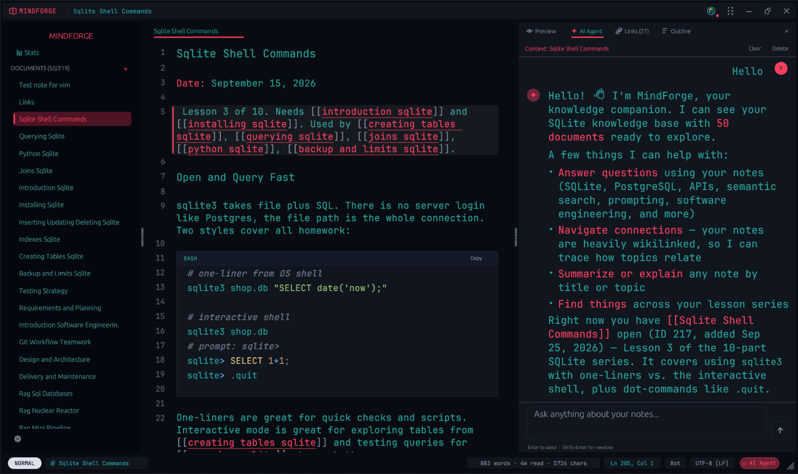
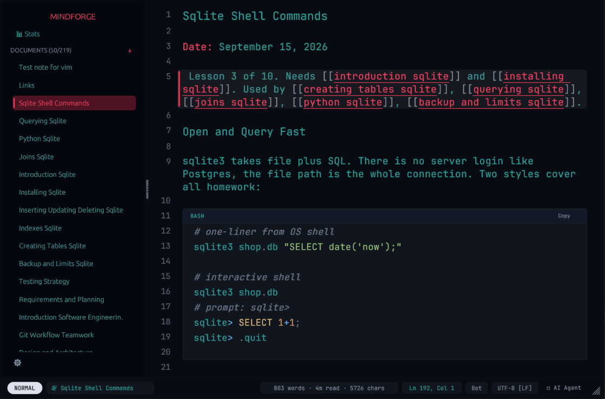
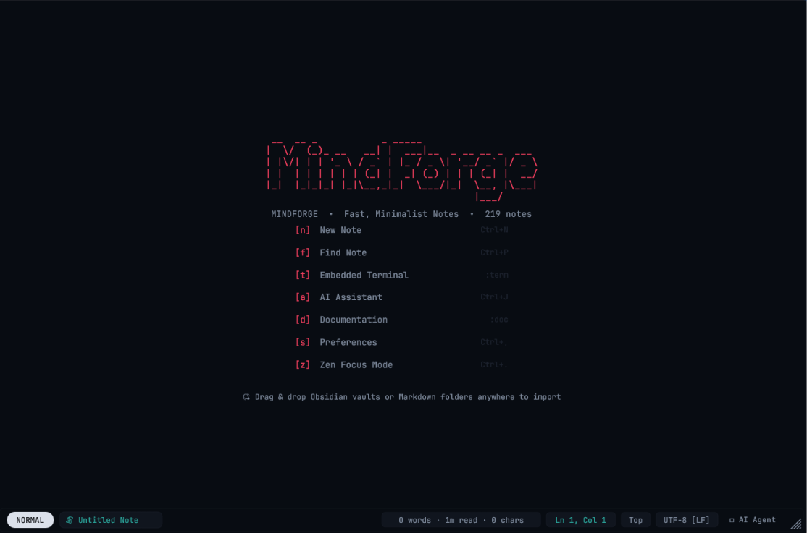

# MINDFORGE

<div align="center">



### The GPU-Accelerated, Local-First Knowledge System Built for Developers.
*Obsidian meets Neovim — reimagined from scratch in pure Rust.*

[](https://www.rust-lang.org/)
[](https://github.com/emilk/egui)
[](https://www.vim.org/)
[](https://www.sqlite.org/)
[](https://github.com/Saboor-Hamedi/mindforge)
[](https://github.com/Saboor-Hamedi/mindforge/releases)
[](https://github.com/Saboor-Hamedi/mindforge/discussions)
[](LICENSE)

[**Quick Start**](#-quick-start) •
[**Core Features**](#-core-features) •
[**Showcase**](#-showcase) •
[**Animated Carets**](#-animated-physics-carets) •
[**Vim Engine**](#-vim-modal-editing) •
[**Shortcuts & Commands**](#-essential-keyboard-shortcuts) •
[**Architecture & egui**](#-built-with-egui) •
[**Discussions**](https://github.com/Saboor-Hamedi/mindforge/discussions)

</div>

---

## ⚡ Why MINDFORGE?

Modern note-taking tools and knowledge bases are bogged down by sluggish web runtimes, high memory footprints, and cloud dependencies. 

**MINDFORGE** is an uncompromising, pitch-black developer environment engineered from the ground up in **100% native Rust**. Powered by the blazing-fast immediate-mode GUI library [**egui**](https://github.com/emilk/egui), MINDFORGE launches instantaneously, uses less than 30MB of RAM, and paints every frame directly onto your GPU at 120+ FPS.

No Chromium. No Electron. Zero telemetry. Just your thoughts, your code, and your knowledge — strictly offline in local SQLite.

---

## 📸 Showcase & Interface Slides

<div align="center">
  <p><i>Click on any slide thumbnail below to jump directly, or expand the slides to inspect full high-resolution interface views:</i></p>

  <table>
    <tr>
      <td align="center" width="33%">
        <a href="#-slide-1-fullscreen-zen-workspace--dual-pane-preview">
          <br />
          <b>Slide 1: Zen Workspace</b>
        </a>
      </td>
      <td align="center" width="33%">
        <a href="#-slide-2-live-inline-markdown-editor--coding-ligatures">
          <br />
          <b>Slide 2: Inline Editor</b>
        </a>
      </td>
      <td align="center" width="33%">
        <a href="#-slide-3-minimalist-welcome-dashboard--knowledge-hub">
          <br />
          <b>Slide 3: Welcome Hub</b>
        </a>
      </td>
    </tr>
  </table>
</div>

<br />

<details open id="-slide-1-fullscreen-zen-workspace--dual-pane-preview">
  <summary><h3>🌌 Slide 1: Fullscreen Zen Workspace & Dual-Pane Preview</h3></summary>
  <p align="center">
    <i>Borderless pitch-black window, floating outline sidebar, and real-time live preview powered by GPU rendering.</i><br/><br/>
    <a href="images/fullscreen.png">
      
    </a>
  </p>
</details>

<details open id="-slide-2-live-inline-markdown-editor--coding-ligatures">
  <summary><h3>✍️ Slide 2: Live Inline Markdown Editor & Coding Ligatures</h3></summary>
  <p align="center">
    <i>Active-line syntax expansion, pixel-aligned selection, interactive task checkboxes, and coding font ligatures (<code>-&gt;</code>, <code>=&gt;</code>, <code>===&gt;</code>, <code>!=</code>, <code>===</code>).</i><br/><br/>
    <a href="images/editor.png">
      
    </a>
  </p>
</details>

<details open id="-slide-3-minimalist-welcome-dashboard--knowledge-hub">
  <summary><h3>🚀 Slide 3: Minimalist Welcome Dashboard & Knowledge Hub</h3></summary>
  <p align="center">
    <i>Instant document launchpad, recent notes, fast keyboard navigation, and zero-latency fuzzy search.</i><br/><br/>
    <a href="images/welcome.png">
      
    </a>
  </p>
</details>

---

## 🚀 Core Features

### 1. ✍️ Live-Rendered Inline Markdown
- **Active-Line Expansion**: Inactive lines render beautifully formatted typography (bold, italics, code pills, links, custom task checkboxes); clicking onto a line smoothly reveals the raw markdown markup for exact character editing.
- **Geometric Font Ligatures**: Symbols such as `->`, `=>`, `==>`, `===>`, `!=`, `<=`, `>=`, and `===` render as seamless font ligatures across both the live editor and markdown preview without disrupting monospace grid alignment.
- **Dedicated Editor Typography**: Select between developer classics including **JetBrains Mono**, **Fira Code**, **Cascadia Code**, **Victor Mono**, and **Iosevka**.
- **Interactive Vector Checkboxes**: Toggle tasks directly by clicking vector checkboxes with smooth state updates.

### 2. 🧠 Second Brain Knowledge Network
- **Bi-Directional `[[Wikilinks]]`**: Connect your thoughts with automatic wikilink resolution (`[[Topic Name]]` or `[[Target|Alias]]`).
- **Screen-Adaptive Autocompletion**: Type `[[` anywhere to summon fuzzy note completion. The autocomplete popup intelligently samples available viewport space to position itself seamlessly above or below the cursor.
- **Live Hover Previews**: Hover over any wikilink to inspect document contents and metadata without switching tabs or losing focus.
- **Document Backlinks & Outline**: Automatic document tree extraction and reverse-reference tracking.

### 3. ⌨️ Modal Vim Engine
- Full modal editing with **Normal**, **Visual**, and **Insert** modes.
- True text objects: change inside quotes (`ci"`), delete around words (`daw`), select paragraphs (`vip`), format brackets (`ci{`, `ca[`).
- Repeatable motions, linewise operations (`dd`, `yy`, `p`), search indexing (`/`, `n`, `N`), and interactive visual selections.

### 4. 📚 Spaced Repetition (SuperMemo SM-2)
- Built-in retrieval practice engine based on the **SM-2 algorithm**.
- Review cards due today, type answers from memory, measure typing speed (WPM), and calibrate retention with difficulty ratings.
- Create cards on the fly with `:add Question | Answer | tag`.

### 5. 🔬 Feynman Technique Scratchpad (`:explain`)
- Distraction-free scratchpad designed to explain complex topics in simple terms.
- Eliminates context-switching while mastering technical concepts.

### 6. ⚖️ Calibrated Decision Journal (`:decide`, `:resolve`)
- Log critical decisions, rationales, predictions, and confidence levels (1–99%).
- Track prediction outcomes and evaluate your **Brier score** (0.00 = perfect calibration). Discover cognitive blind spots with bucketed calibration charts.

---

## 🔥 Animated Physics Carets

MINDFORGE features 13 custom-rendered cursor shaders and particle emitters. Toggle via `Ctrl+,` or with `:caret <style>`:

| Caret Style | Visual Behavior |
|:---|:---|
| `fire` | Glowing flame base with physics-driven rising spark particles |
| `water` | Liquid droplet cursor with gravity dynamics and baseline ripples |
| `electric` | Snapping high-voltage crackling lightning bolts branching on keypresses |
| `matrix` | Cascading green phosphor digital rain glyphs |
| `ice` | Crystalline cyan frost shards with natural horizontal drift |
| `glitch` | Cyberpunk RGB chromatic aberration split with micro-jitter |
| `neon` | Multi-layer atmospheric glowing aura |
| `heartbeat` | Smooth rhythmic organic pulse breathing animation |
| `comet` | Motion-blur fading trail following cursor navigation |
| `rainbow` | Dynamic shifting HSV color spectrum |
| `block` / `beam` / `underline` | Precision geometric cursors |

---

## ⚡ Built with [egui](https://github.com/emilk/egui)

MINDFORGE is built on top of [**egui**](https://github.com/emilk/egui) (and [eframe](https://github.com/emilk/egui/tree/master/crates/eframe)), the cutting-edge immediate mode GUI library for Rust created by [Emil Ernerfeldt](https://github.com/emilk).

### How MINDFORGE leverages egui:
- **Instant Response Times**: Immediate-mode layout allows sub-millisecond keyboard response and butter-smooth scrolling.
- **Custom Galley & CharMap Invariants**: Custom `CharMapBuilder` maps variable-width inline markdown tokens, soft-wrapping galleys, and custom ligatures back to exact buffer indices with zero drift.
- **GPU Painter Primitives**: High-speed particle rendering, custom antialiased rounded cards, and vector checkboxes drawn directly through egui's painter pipeline.
- **Multi-Theme Palette**: 19 WCAG-verified themes (Tokyo Night, Catppuccin, Dracula, Nord, Rosé Pine, Monokai, Gruvbox, and more) calibrated for maximum reading comfort.

Check out the upstream [egui repository](https://github.com/emilk/egui) to learn more about building GUI applications in Rust!

---

## ⌨️ Essential Keyboard Shortcuts

| Shortcut | Action |
|:---|:---|
| `Ctrl + P` | Instant Subsequence Fuzzy Note Search |
| `Ctrl + Shift + P` / `Ctrl + ,` | Open Settings & Customization Modal |
| `Ctrl + S` | Force Save Document to SQLite |
| `Ctrl + N` | Create New Note |
| `Ctrl + R` / `F2` | Rename Active Note |
| `Ctrl + Shift + D` | Delete Active Note |
| `Ctrl + W` | Close Active Tab |
| `Ctrl + 1` .. `Ctrl + 9` | Direct Tab Jump (1–9) |
| `Ctrl + Tab` / `Ctrl + Shift + Tab` | Cycle Tabs Next / Previous |
| `Ctrl + B` | Toggle Sleek Floating Sidebar (`j`/`k` navigate, `Enter` load, `Tab`/`l` editor) |
| `Ctrl + E` | Toggle between Inline WYSIWYG & Raw Monospace Canvas |
| `Ctrl + \` | Toggle Real-Time Split Preview |
| `Ctrl + .` | Toggle Zen Mode (Pitch-Black Distraction Free) |
| `Ctrl + [` / `Ctrl + ]` | Dedent / Indent Current Line |
| `Ctrl + Shift + X` | Toggle Task Checkbox (`- [ ]` ↔ `- [x]`) |
| `F1` / `Ctrl + H` | Open Help & Built-in Documentation |
| `F11` | Toggle Fullscreen |
| `Alt + Left Drag` | Move Borderless Window |
| `:` | Open Command Dock (with live autocomplete & fuzzy suggestions) |
| `Escape` | Dismiss Modals / Autocomplete / Return to Normal Mode |

---

## ⚡ The `:` Command Dock & Autocomplete Engine

MINDFORGE includes an integrated command runner inspired by Vim and modern developer environments. 

Press **`:`** while in Normal Mode (or click the bottom dock) to summon the command bar.

### 🔍 Live Fuzzy Autocomplete & Suggestions
As you type after `:`, MINDFORGE instantly opens a floating autocomplete window with live fuzzy-matched candidates ranked from your **command history** and the **built-in command catalog**:
- **Navigate suggestions**: Press `Up` / `Down` or `Ctrl + K` / `Ctrl + J`.
- **Autocomplete**: Press `Tab` to fill the highlighted command into the prompt.
- **Execute**: Press `Enter` to run the command immediately.
- **Dismiss**: Press `Escape` to close the command dock.
- **History recall**: MINDFORGE stores a persistent bash-like history of your last 200 executed commands.

### 📋 Available `:` Commands

| Category | Command | Description |
|:---|:---|:---|
| **Files & Storage** | `:w` / `:write` | Save active note to SQLite |
| | `:q` / `:quit` | Close active tab or view |
| | `:wq` / `:x` | Save note and close tab |
| | `:r [title]` | Rename the active note |
| | `:d` | Delete the active note |
| | `:clear` | Clear active buffer |
| | `:export` | Export note to Markdown (`.md`) file |
| | `:import` | Import an external text or markdown file |
| | `:backup` | Create an immediate SQLite point-in-time snapshot |
| **Themes & Customization** | `:theme [name]` | Live switch between 19 themes (`tokyo_night`, `catppuccin`, `dracula`, `nord`, etc.) |
| | `:font [name]` | Switch typography (`jetbrains_mono`, `fira_code`, `cascadia_code`, `victor_mono`, `iosevka`) |
| | `:caret [style]` | Switch animated cursors (`fire`, `water`, `electric`, `matrix`, `ice`, `glitch`, `neon`, etc.) |
| | `:luna [style]` | Switch LunaLine status bar style (`pill`, `powerline`, `floating`, `minimal`) |
| | `:sound [profile]` | Configure mechanical switch typing audio (`thocky`, `clacky`, `silent`, `off`) |
| | `:settings` | Open preferences and customization modal (`Ctrl+Shift+P` / `Ctrl+,`) |
| **Panes & Views** | `:preview` / `:nopreview` | Toggle or close Markdown live split preview |
| | `:sidebar` | Toggle floating notes sidebar |
| | `:outline` / `:ol` | Toggle document headings outline panel |
| | `:backlinks` / `:bl` | Toggle bi-directional backlinks panel |
| | `:term` | Toggle embedded terminal pane |
| | `:doc` | Open built-in reference documentation reader |
| | `:zen` | Toggle distraction-free Zen mode |
| | `:ai` | Toggle DeepSeek AI Assistant drawer |
| | `:tabs` | Toggle document tabs strip |
| | `:titlebar` | Toggle window titlebar |
| | `:stats` | View productivity statistics and word counts |
| | `:scan` / `:scans` | Run web security vulnerability scan or review scan history |
| **Editor Configuration** | `:set nu` / `:set nonu` | Show or hide line numbers |
| | `:set showcmd` / `:set noshowcmd` | Toggle floating keystroke visualizer card |
| | `:mode [vim\|hybrid]` | Switch between Vim modal motions and Hybrid writing |
| | `:live` / `:raw` | Switch between inline rendered markdown and raw monospace |
| | `:noh` | Clear search highlight matches |
| **Cognitive Frameworks** | `:explain` | Open Feynman technique scratchpad for concept deconstruction |
| | `:decide` / `:resolve` | Open calibrated decision journal and Brier score tracking |
| | `:add Q \| A \| tag` | Create a spaced repetition retrieval card (SuperMemo SM-2) |

---

## 📦 Quick Start

### Prerequisites
Make sure you have the [Rust toolchain](https://rustup.rs/) installed (1.78+ recommended).

### Installation & Run

```bash
# Clone the repository
git clone https://github.com/Saboor-Hamedi/mindforge.git
cd mindforge

# Run with maximum GPU optimizations
cargo run --release
```

### Running Test Suite
MINDFORGE maintains an extensive suite of 187 unit tests covering font metrics, inline markdown layout invariants, Vim text objects, and Wikilink resolution:

```bash
cargo test --workspace
```

---

## 🔒 Local-First Data Privacy

All notes, spaced repetition decks, settings, and decisions are stored locally in an embedded SQLite database.
- **Windows Path:** `%LOCALAPPDATA%\mindforge\mindforge\data\mindforge.db`
- **Linux / macOS:** `~/.local/share/mindforge/mindforge.db`

Backing up your entire knowledge graph is as simple as copying `mindforge.db`.

---

## 🤝 Contributing

Contributions, issues, and feature requests are welcome! Feel free to check the [issues page](https://github.com/Saboor-Hamedi/mindforge/issues) or join the [community discussions](https://github.com/Saboor-Hamedi/mindforge/discussions).

1. Fork the Project
2. Create your Feature Branch (`git checkout -b feature/AmazingFeature`)
3. Commit your Changes (`git commit -m 'feat: Add AmazingFeature'`)
4. Push to the Branch (`git push origin feature/AmazingFeature`)
5. Open a Pull Request

---

## 📄 License

Distributed under the MIT License. See `LICENSE` for more information.

<div align="center">
  <sub>Crafted with passion in pure Rust 🦀 and powered by <a href="https://github.com/emilk/egui">egui</a>.</sub>
</div>
